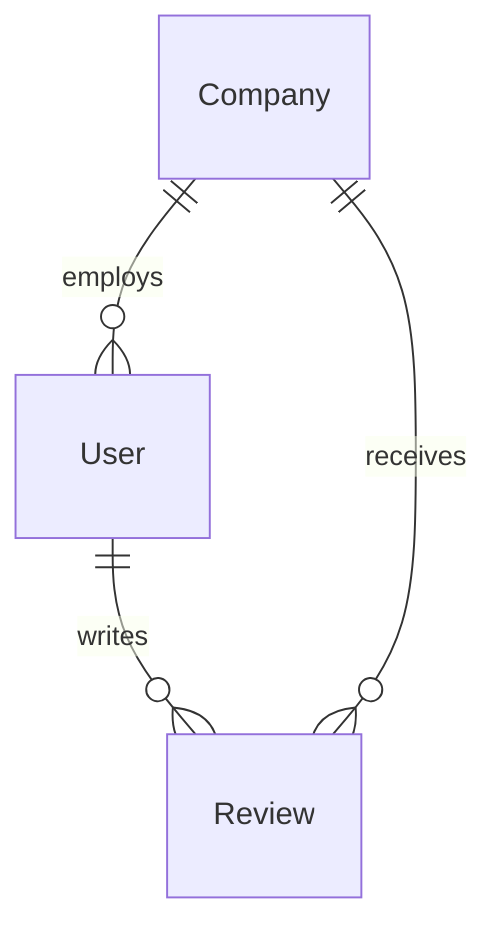

# 백엔드 모델 명세

## 1. User 모델
사용자 정보를 저장하는 모델입니다.

## 2. Company 모델
회사 정보를 저장하는 모델입니다.

## 3. Review 모델
리뷰 정보를 저장하는 모델입니다.

## 모델 관계도

## 상세 스키마
각 모델의 상세 필드 정보는 `backend/schemas/` 디렉토리의 해당 스키마 파일을 참조하세요. 